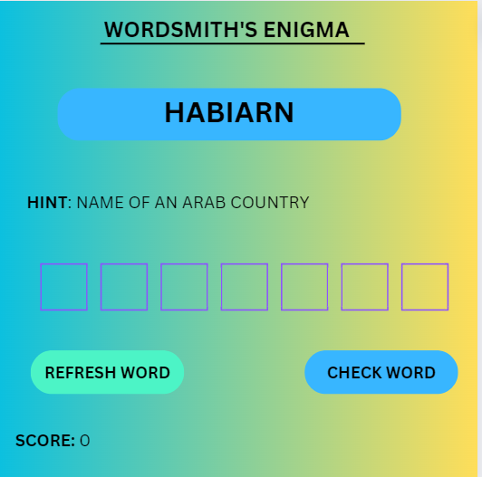

# Wordsmith's Enigma
## Date: 5/2/2024

### By: Osama 

#### [GitHub](https://github.com/OsamaMohammad61)
***

## ***Description***
#### It is a Game in which scrambled word will be shown on the screen and based on them the palyer has to guess th right word in a given time .

#### for example the word can be shown HABIARN along with a hint and the user has to guess what is the right word which in this case is Bahrain
***

## ***Technologies Used***
* HTML
* CSS
* JavaScript
***

## ***Getting Started***

##### On a HTML page the user will press on the start game button which will take them to another page in which the game will be displayed in which a scrambled word will be shown and the user will have to enter the correct word in the provided space. After that user will click on the check button which will then analyze if the user has enetered the correct word or not and then it will show the results 
***

## ***Wireframe***

### Game's wireframe

***

## ***Future Updates***

- [ ] Increased number of words
- [ ] Increase words complexity
- [ ] Add a celebration screen when score reaches 100

***

### ***Credits***

##### WireFrame: [Canva ](https://www.canva.com/)

##### Markdown Guide: [SEI9 Github](https://github.com/SEI-09-Bahrain/u1_hw_markdown)

***